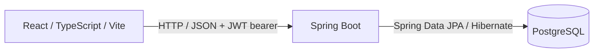
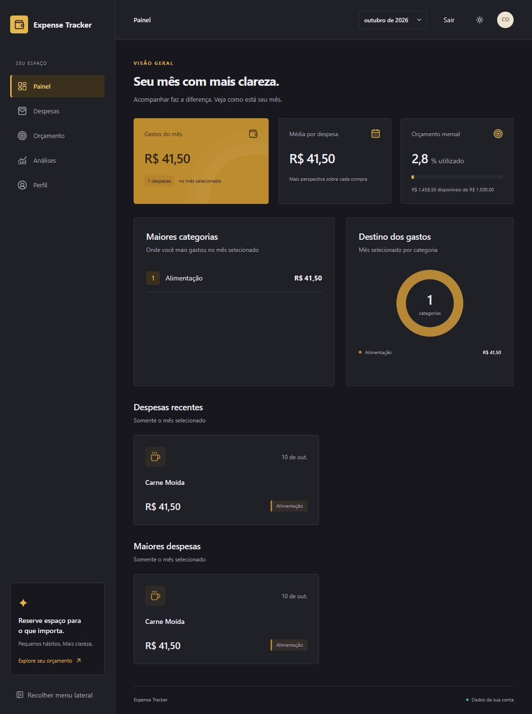
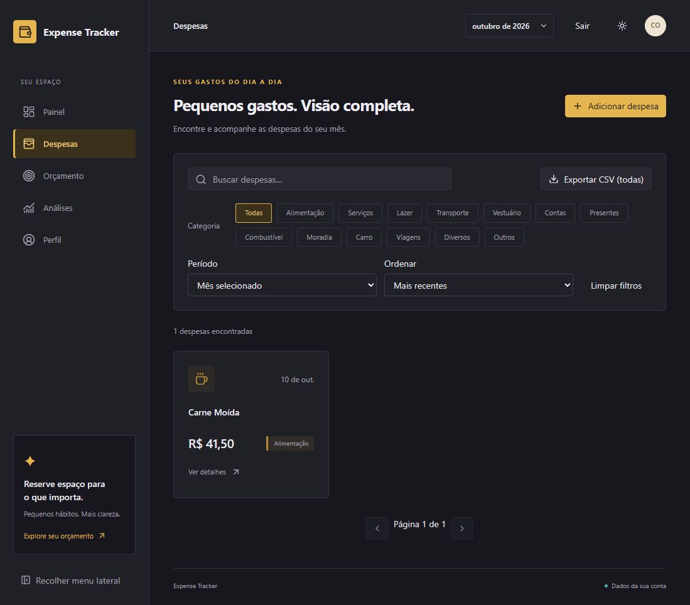
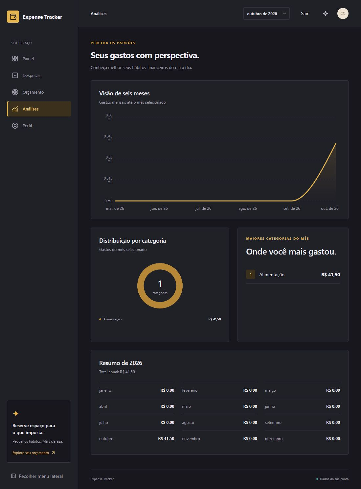

# Expense Tracker

A full-stack personal expense manager built with React, TypeScript, Spring Boot, and PostgreSQL. Users manage their own expenses, follow monthly spending, set budgets, and review spending patterns.

**Status:** v1 is deployed, with automated backend and frontend verification configured in GitHub Actions.

## Deployed app

- **Live frontend (Vercel):** [Open Expense Tracker](https://expense-tracker-coelho.vercel.app)
- **Backend API (Railway):** [API base URL](https://expense-tracker-production-4dc6.up.railway.app) — protected API routes require a JWT; the base URL is not a browser landing page.
- **Health monitoring:** [Health endpoint](https://expense-tracker-production-4dc6.up.railway.app/actuator/health) is public after the backend deploys this revision. Other actuator paths still require authentication and must also be exposed by Actuator configuration to be available.

Sign in or register to use the deployed app. Each account sees its own data.

The product brand is **Expense Tracker**. The interface is Brazilian Portuguese (pt-BR), with Brazilian date/number conventions and BRL currency formatting. Financial pages use the authenticated account's data rather than seeded demonstration data.

## v1 capabilities

- **Authentication:** registration, email/password login, JWT session restoration, protected pages, and logout.
- **Profile:** view the current account, update username, email, or password separately, and permanently delete the account.
- **Expenses:** create, read, edit, and delete expenses with description, amount, date/time, and category. Search descriptions, filter by category or date/period, sort, and paginate results.
- **CSV export:** download every expense owned by the account. Export does not apply the list's active filters.
- **Dashboard:** selected-month total, average expense amount, expense count, category totals, top categories, budget status, and up to five recent and five largest expenses within that month.
- **Budgeting:** create/update a monthly limit and view spent amount, remaining amount, percentage spent, and over-budget status. A missing budget has its own UI state.
- **Analytics:** six-month spending trend ending in the selected month, monthly category distribution/top categories, and an annual summary.
- **Frontend:** responsive layouts, light/dark themes, pt-BR validation and feedback, loading/empty/error states, retry actions, and confirmation dialogs.

## Architecture



The frontend's Axios client centralizes the API base URL, bearer token, timeout, and protected-request 401 handling. Spring MVC controllers accept validated DTOs; services implement business rules; repositories and JPA specifications provide persistence and filtering. Authenticated controllers derive the account ID from the JWT subject. Expense and budget queries scope data to that account.

### Stack

| Layer | Technologies |
| --- | --- |
| Backend | Java 25; Spring Boot 4.1.1; Spring MVC; Spring Data JPA/Hibernate; Jakarta Validation; Spring Security; OAuth2 Resource Server/Nimbus JWT; BCrypt; PostgreSQL JDBC; Actuator |
| Backend tooling/tests | Maven wrapper (3.9.16); JUnit Jupiter, Mockito, Spring Boot/Security test support; Testcontainers with PostgreSQL 18 Alpine |
| Frontend | React 19; TypeScript 6; Vite 8; React Router 7; Axios; Tailwind CSS 4; Radix UI; Lucide icons; Recharts 3 |
| Frontend tooling/tests | npm lockfile; Oxlint; Node's built-in test runner |

Backend versions come from [pom.xml](expensetrackerapi/pom.xml); frontend dependency ranges and scripts are in [package.json](expensetrackerweb/package.json), with resolved versions in [package-lock.json](expensetrackerweb/package-lock.json).

## Local development

### Prerequisites

- JDK 25 with `JAVA_HOME` configured.
- Node.js satisfying Vite's locked engine requirement: `^20.19.0 || >=22.12.0`, plus npm. Verification used Node 24.19.0.
- A reachable PostgreSQL instance and an existing database (default name: `expensetracker`). Flyway applies versioned schema migrations; Hibernate validates the schema. The database itself must already exist.
- For the complete backend test suite, a Docker environment accessible to Testcontainers and permission to pull `postgres:18-alpine`.

Commands below use PowerShell and start from the repository root unless indicated. Maven is supplied by the wrapper; no global Maven installation is required. Initial dependency downloads require network access.

### Backend

Provide `DB_PASSWORD` and `JWT_SECRET` in the backend process environment, using your local credentials and your own Base64-encoded signing key. Optional `DB_URL` and `DB_USERNAME` override the defaults listed below. For HS256, use a randomly generated key of at least 32 bytes before Base64 encoding. Do not commit credentials or signing keys.

Configure these variables through your terminal environment or IDE run configuration, then run:

```powershell
cd expensetrackerapi
.\mvnw.cmd spring-boot:run "-Dspring-boot.run.profiles=dev"
```

The API uses Spring Boot's default address `http://localhost:8080`. There is no backend `.env.example` or automatic dotenv loader in the repository; a `.env` file alone does not configure this process. On Unix-like systems, use `./mvnw` instead of `.\mvnw.cmd`.

### Frontend

Open a second terminal from the repository root:

```powershell
cd expensetrackerweb
Copy-Item .env.example .env.local
npm ci
npm run dev -- --host localhost --port 5173 --strictPort
```

Open `http://localhost:5173`. The dev profile permits that origin by default; set `CORS_ALLOWED_ORIGIN` to override it. `http://127.0.0.1:5173` and other ports are different origins. Register an account to begin adding expenses.

The example points to the local API. Restart Vite after changing frontend variables. `npm run build` produces `dist/`; `npm run preview` serves that build locally, but set `CORS_ALLOWED_ORIGIN` to its origin before starting the backend.

## Configuration

| Variable / property | Required / default | Purpose |
| --- | --- | --- |
| `DB_URL` | Dev default: `jdbc:postgresql://localhost:5432/expensetracker`; required otherwise | Backend PostgreSQL JDBC URL |
| `DB_USERNAME` | Dev default: `postgres`; required otherwise | Database username |
| `DB_PASSWORD` | Required; no default | Database password; keep private |
| `CORS_ALLOWED_ORIGIN` | Dev default: `http://localhost:5173`; required otherwise | Single allowed frontend origin (scheme, host, optional port; no path or trailing slash) |
| `JWT_SECRET` | Required; no default | Base64-encoded HMAC signing key; keep private |
| `jwt.expiration` | Configured as `604800000` milliseconds (7 days) | JWT lifetime in backend properties |
| `VITE_API_BASE_URL` | Example and client fallback: `http://localhost:8080` | Public frontend API base URL, without an `/api` suffix |

See [application.properties](expensetrackerapi/src/main/resources/application.properties) and the frontend [.env.example](expensetrackerweb/.env.example). `VITE_API_BASE_URL` is included in the browser build and must never contain secrets; set it before building for another environment.

Shared `application.properties` keeps Hibernate at `validate`, JWT expiration at 7 days, SQL logging off, and required environment-backed database, JWT, and CORS settings. Flyway remains enabled through Spring Boot and applies `db/migration` scripts at startup before Hibernate validates the schema.

Select exactly one environment profile. `dev` enables SQL logging and supplies only the local database URL, username, and CORS defaults. `prod` explicitly disables SQL logging and inherits all required values without local fallbacks. No profile is selected automatically: with no active profile, shared settings apply and the same explicit environment values are required. Do not activate `dev` and `prod` together.

For production, inject `SPRING_PROFILES_ACTIVE=prod`, `DB_URL`, `DB_USERNAME`, `DB_PASSWORD`, `JWT_SECRET`, and `CORS_ALLOWED_ORIGIN` through the hosting platform. Build with `./mvnw package` (or `.\mvnw.cmd package`), then run `java -jar target/expensetrackerapi-0.0.1-SNAPSHOT.jar`. The CORS property `app.cors.allowed-origin` permits one exact origin; allowed methods and headers are unchanged. Missing required values prevent successful application startup. A backend `.env` file is not loaded automatically.

## API overview

Paths are relative to the API base URL. Except for login, registration, and the exact `/actuator/health` path, routes require `Authorization: Bearer <token>`. Responses are JSON except CSV export and empty deletion responses.

| Access | Method | Route | Purpose |
| --- | --- | --- | --- |
| Public | POST | `/api/auth/register` | Create an account; returns user details (201), not a JWT |
| Public | POST | `/api/auth/login` | Authenticate email/password; returns `{ token }` |
| Public | GET | `/actuator/health` | Actuator health status; details follow the default Actuator visibility policy |
| Authenticated | GET / DELETE | `/api/users/me` | Current profile / delete account (204) |
| Authenticated | PATCH | `/api/users/me/username`, `/email`, `/password` | Update one profile field; abbreviated suffixes share `/api/users/me` |
| Authenticated | GET / POST | `/api/expenses` | Filtered paginated list / create expense (201) |
| Authenticated | GET / PATCH / DELETE | `/api/expenses/{id}` | Read, update, or delete an owned expense (delete: 204) |
| Authenticated | GET | `/api/expenses/export` | Download `expenses.csv` for the entire account |
| Authenticated | GET | `/api/expenses/dashboard` | Combined selected-month dashboard |
| Authenticated | GET / PUT | `/api/budgets/monthly` | Read status / create or update monthly budget |
| Authenticated | GET | `/api/expenses/monthly-total`, `/monthly-category-summary`, `/top-spending-categories`, `/average-spending`, `/count-of-expenses` | Monthly aggregates; all suffixes share `/api/expenses` |
| Authenticated | GET | `/api/expenses/monthly-totals-over-time` | Monthly totals over a supplied range |
| Authenticated | GET | `/api/expenses/yearly-summary` | Annual total and monthly totals |
| Authenticated | GET | `/api/expenses/recent`, `/api/expenses/largest` | All-time ranked lists; default limit 5, allowed 1–100 |

Monthly dashboard, aggregate, and budget routes use `year` and `month`; yearly summary uses `year`. Trend uses `startYear`, `startMonth`, `endYear`, and `endMonth`. Month-scoped recent/largest lists are included in the dashboard response; the standalone ranked routes are all-time. Budget PUT accepts `{ amount }`; GET returns 404 when no monthly budget exists, while the dashboard represents it as `null`.

The expense list accepts `category`, `description` (case-insensitive search), `startDate`/`endDate`, `period`, `sortBy`, `direction`, `page`, and `size`. Dates are local date-times; both inclusive range boundaries must be supplied together. Choose a date range or a period, not both. Period values are `THIS_MONTH`, `LAST_MONTH`, `LAST_7_DAYS`, `LAST_30_DAYS`, and `THIS_YEAR`, relative to the server clock. Sorting supports `date`, `amount`, or `description`, with `asc`/`desc`; default is date descending. Pagination is zero-based, default size 10, allowed size 1–100; the frontend requests six items per page. The response contains `content`, `page`, `size`, `totalElements`, and `totalPages`.

The frontend performs registration, then login, then `/api/users/me` to establish the session. There is no token-refresh or server logout endpoint.

## Security and design notes

- Passwords are hashed with BCrypt when created or changed. Profile response DTOs omit password hashes.
- Spring Security validates signed JWT bearer tokens and expiration. Sessions are stateless; CSRF is disabled for this bearer-auth API. Login, registration, and the exact `/actuator/health` path are explicitly public. Other actuator paths, including health subpaths, remain authenticated; no wildcard actuator permission is granted.
- Ownership comes from the JWT subject, rather than a client-supplied owner ID. Expense lookups/mutations, lists, exports, analytics, and budgets are scoped to that ID.
- Account deletion transactionally deletes that account's expenses and budgets before deleting the user. The frontend confirms deletion and clears its local session after success.
- The browser keeps the JWT in memory and `sessionStorage` under `expense-auth-token`, with a memory-only fallback. Protected 401 responses and expiration clear the session; stale responses from an older session are guarded against. This storage is accessible to same-origin JavaScript, so XSS prevention matters.
- Logout clears the local session. Existing signed JWTs are not revoked by logout, password changes, or account deletion; there is no revocation mechanism. Deleting an account removes its data and profile, but does not invalidate the token signature before expiration.
- Amounts and budget calculations use `BigDecimal` in the backend. Expense timestamps use `LocalDateTime`; no timezone offset is stored in that type.

## Testing and verification

From `expensetrackerapi`, with backend database environment configured and Docker available:

```powershell
.\mvnw.cmd test "-Dspring.profiles.active=dev"
```

The context-load test uses the configured PostgreSQL connection (and supplies its own test JWT key). Repository tests use Testcontainers-managed PostgreSQL. Use a development/test database rather than production; the context runs Flyway migrations and then validates the schema.

From `expensetrackerweb`:

```powershell
npm test
npm run build
npm run lint
```

Frontend tests cover token handling, protected/public 401 behavior, stale-session responses, dashboard contracts, dates/categories, expense filters and CRUD/CSV, pagination recovery, budgets, analytics, profile, deletion, and cancellation. They are focused client/contract tests, not browser end-to-end tests. Backend tests cover controllers, services, CSV, persistence queries, and context startup.

Verification on **2026-10-10** for this finalization: all **20 frontend tests** passed; Oxlint and the TypeScript/Vite production build passed. The new focused security suite passed **3/3 tests**, covering public health, protected actuator/application paths, and invalid bearer rejection. The full backend run reported **43 tests: 40 passed, 3 errors, 0 assertion failures, 0 skipped**. The three repository classes failed during Testcontainers initialization because local Docker was unavailable; a complete passing backend suite is not claimed locally.

## Continuous integration

[CI workflow](.github/workflows/ci.yml) runs on pushes to `main`, pull requests targeting `main`, and manual dispatch. Both jobs run for every trigger, including documentation changes. It uses read-only repository permissions and cancels superseded runs for the same ref.

- **Backend:** Ubuntu, Eclipse Temurin Java 25, Maven dependency cache, and `bash ./mvnw --batch-mode --no-transfer-progress verify` from `expensetrackerapi`. A health-checked PostgreSQL 18 Alpine service supplies a disposable database for the full application context. The runner's Docker daemon is checked and remains available for the repository tests' separate Testcontainers databases. No tests are skipped. Surefire reports are uploaded even when the job fails. Timeout: 20 minutes.
- **Frontend:** Ubuntu, Node 24, npm cache keyed by the frontend lockfile, then `npm ci`, `npm test`, `npm run lint`, and `npm run build` from `expensetrackerweb`. Timeout: 10 minutes.

CI uses explicit, deterministic test-only database credentials, JWT key, and localhost CORS origin; it does not read deployment secrets or connect to production. The backend runs with the `prod` profile to exercise migrations and schema validation with those disposable values. This workflow verifies and packages the project; hosting platforms manage any automatic redeployment independently.

## Project structure

```text
expense-tracker/
├── README.md                         # Project overview and setup
├── expensetrackerapi/
│   ├── README.md                     # Backend contributor notes
│   ├── pom.xml, mvnw, mvnw.cmd        # Dependencies and Maven wrapper
│   └── src/
│       ├── main/java/com/expensetracker/
│       │   ├── config/, security/    # CORS, passwords, JWT/security configuration
│       │   ├── controller/, dto/     # HTTP routes and request/response contracts
│       │   ├── service/              # Application/business rules
│       │   ├── entity/, repository/  # Persistence model and queries
│       │   ├── specification/        # Expense filtering predicates
│       │   └── exception/            # Application errors and HTTP handling
│       ├── main/resources/           # application.properties
│       └── test/java/                # Controller, service, repository/context tests
└── expensetrackerweb/
    ├── README.md, .env.example        # Frontend notes and public config example
    ├── package.json, package-lock.json
    ├── public/                       # Wallet favicon
    ├── src/
    │   ├── auth/                     # Session provider/context and route guard
    │   ├── pages/                    # Auth, dashboard, expenses, budget, analytics, profile
    │   ├── components/               # Layout, charts, themes, shared/UI components
    │   ├── lib/                      # API clients, formatting, resource handling
    │   └── data/                     # Category labels/presentation
    └── tests/                        # Node client/contract tests
```

## Production screenshots

Captured from the [deployed Vercel app](https://expense-tracker-coelho.vercel.app) on **2026-10-10**, using the authenticated account selected for screenshots. These are real production views; no records or UI were generated for the captures.

### Dashboard — dark theme

Selected-month spending, budget, categories, and recent/largest expenses.



### Expenses — dark theme

Production expense list with category, period, sorting, and CSV controls.



### Analytics — dark theme

Six-month trend, category distribution, and annual summary.



### Mobile dashboard — light theme

Responsive dashboard captured at a 390 × 844 CSS-pixel viewport.


## Operational notes

The frontend and API are deployed on Vercel and Railway. GitHub Actions verifies changes on main and pull requests. Public health access becomes available when Railway deploys this revision. Hosting redeployment depends on each platform's repository integration.

Backups, recovery procedures, and ongoing monitoring are hosting operational responsibilities; their configuration is not verified by this repository. Local backend verification still requires a working Docker environment for the complete Testcontainers suite.
